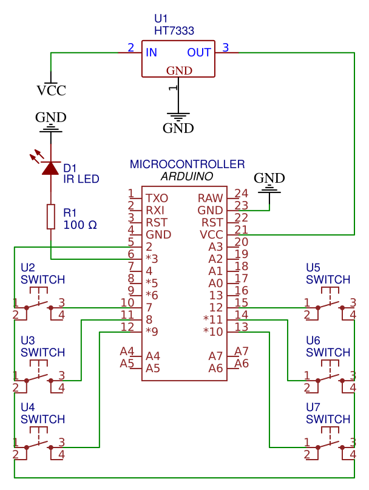
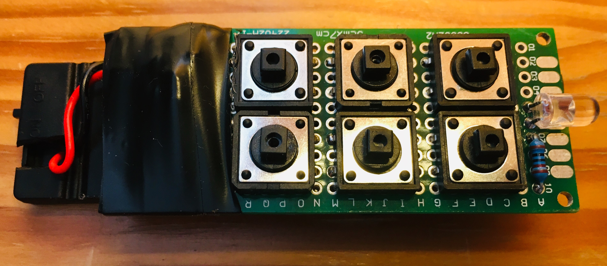
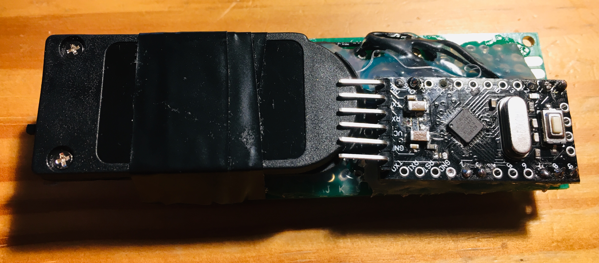

# Infrared Remote Control

This repository contains circuit diagram and code for low power infrared remote control using Arduino.

## Circuit Diagram

## Adjustments To Minimize Power Consumption

I was able to lower the power consumtion of Arduino Pro Mini to 20µA (0.02mA) by:

* Desoldering the always-on power LED
* Desoldering on board voltage regulator and using the HT7333-A voltage regulator instead (with quiescent current around 8µA)
* Utilizing the deep sleep mode using the [LowPower library by rocketscream](https://github.com/rocketscream/Low-Power)

Useful articles on minimizing power consumption of arduino I used as inspiration for my code:

* [How to modify an Arduino Pro Mini (clone) for low power consumption](https://andreasrohner.at/posts/Electronics/How-to-modify-an-Arduino-Pro-Mini-clone-for-low-power-consumption/)
* [Arduino low power - How to run ATMEGA328P for a year on coin cell battery](http://home-automation-community.com/arduino-low-power-how-to-run-atmega328p-for-a-year-on-coin-cell-battery/)

## Overcoming Limited Number Of External Interrupts

During the development, I encountered an issue when lowering the power consumption. I utilized the deep sleep mode that awakes Arduino using external interrupt pins, but there are only two such pins on Arduino Pro Mini. I wanted to have at least 6 buttons, so I had to solve this obstacle somehow.

In most projects, they solve it by having a dedicated "wake up" button. This button is connected to the interrupt pin and awakes arduino from sleep mode. Arduino stays awake for some time to perform required operations and then it is sent to sleep mode again after certain time of inactivity. I decided not to go this way as it would usually mean to press two buttons to send one command.

Instead, I got inspired by [this article](https://create.arduino.cc/projecthub/Svizel_pritula/10-buttons-using-1-interrupt-2bd1f8) that utilizes the fact that Arduino can reconfigure its pins at any time.

It uses two modes

* **Interrupt mode** - in this mode, all buttons are connected to an interrupt pin (set as `INPUT_PULLUP`) on one side and to their own individual pins on other side (set all as `OUTPUT` to `LOW`). After this configuration is set, Arduino enters the sleep mode and waits for a button press. Once any button is pressed, interrupt pin is set to `LOW`, sleep mode is terminated and Arduino rewires internally to distinct mode.
* **Distinct mode** - in this mode, interrupt is detached from an interrupt pin and the pin is reconfigured to `OUTPUT` and set to `LOW`, while all button pins are changed to `INPUT_PULLUP`. In this configuration we can easily find out what button has been pressed and send the corresponding code.

## The Finished Product

